# 🏗️ System Architecture: Privacy-First Smart Photo Search

This document provides a comprehensive breakdown of the architectural design, multimodal AI model pipeline, data flow, and engineering decisions behind **Privacy-First Smart Photo Search**. Built for **OSDHack 2026**, this system is engineered from the ground up to operate entirely on-device with zero cloud dependencies.

---

## 1. High-Level System Diagram

The architecture follows a strict **offline-first, zero-telemetry** design pattern. All operations—from image decoding to vector projection and similarity ranking—execute locally within the user's desktop environment (`CPU / GPU / NPU`).

```mermaid
graph TD
    subgraph Local Desktop Environment [🔒 Local Desktop Environment - Air-Gapped / No Internet Required]
        
        subgraph Storage Layer [📂 Local Filesystem]
            ID["Local Image Directory\n(JPG, PNG, WEBP, BMP)"]
            INDEX["Local Vector Index\n(.photo_index.pt - PyTorch Tensor)"]
        end

        subgraph Ingestion Pipeline [⚙️ Multi-Threaded Ingestion Engine]
            SCAN["Directory Scanner\n(Recursive File Discovery)"]
            DECODE["PIL Image Decoder\n(RGB Conversion)"]
            THREAD["ThreadPoolExecutor\n(4x Parallel Workers)"]
        end

        subgraph AI Vision & Text Engine [🧠 Local CLIP Multimodal Engine - ViT-B/32]
            V_PRE["CLIPProcessor (Vision)\nImage Resize / Normalize / Padding"]
            V_ENC["Vision Transformer\n(ViT-Base-Patch32 Encoder)"]
            V_PROJ["Visual Projection Layer\n(512-Dim Vector Space)"]
            V_NORM["L2 Normalization\n(Unit Sphere Mapping)"]

            T_PRE["CLIPProcessor (Text)\nBPE Tokenizer / Truncation"]
            T_ENC["Text Transformer\n(12-Layer Causal Self-Attention)"]
            T_PROJ["Text Projection Layer\n(512-Dim Vector Space)"]
            T_NORM["L2 Normalization\n(Unit Sphere Mapping)"]
        end

        subgraph Search & Retrieval Engine [⚡ Vector Similarity Engine]
            QUERY["User Natural Language Query\ne.g., 'dog playing in park'"]
            DOT["Matrix Dot Product\n(cosine_sim = embeddings @ text_vec.T)"]
            TOPK["PyTorch Top-K Ranking\n(Top 12 Matches)"]
            FILTER["Strictness Threshold Filter\n(Dynamic UI Slider: 15% - 50%)"]
        end

        subgraph Presentation Layer [🖥️ Streamlit Desktop UI]
            UI["Interactive Gallery Grid\n(Responsive Cards & Captions)"]
            SETTINGS["Engine & Database Management\n(Index Status & Error Logs)"]
        end

    end

    %% Data Flow Connections
    ID --> SCAN
    SCAN --> THREAD
    THREAD --> DECODE
    DECODE --> V_PRE
    V_PRE --> V_ENC
    V_ENC --> V_PROJ
    V_PROJ --> V_NORM
    V_NORM <-->|Read/Write Tensor Cache| INDEX

    QUERY --> T_PRE
    T_PRE --> T_ENC
    T_ENC --> T_PROJ
    T_PROJ --> T_NORM

    INDEX --> DOT
    T_NORM --> DOT
    DOT --> TOPK
    TOPK --> FILTER
    FILTER --> UI
    SETTINGS -.->|Triggers Index Build| SCAN
```

---

## 2. Model Pipeline & Multimodal Spaces

The core AI engine uses **OpenAI's CLIP (Contrastive Language-Image Pretraining)** architecture with a **Vision Transformer (`ViT-Base-Patch32`)** backbone, loaded natively via Hugging Face `transformers` and PyTorch.

### Why CLIP ViT-B/32?
- **Multimodal Alignment:** CLIP maps both images and natural language strings into the exact same **512-dimensional continuous vector space**. A photo of a golden retriever and the text query `"a dog playing"` yield high cosine similarity when their internal semantic representations align.
- **Zero-Shot Generalization:** Unlike traditional object classification models limited to fixed 1,000-class ImageNet categories, CLIP understands open-vocabulary queries, abstract concepts (`"peaceful morning"`, `"party vibe"`), lighting conditions (`"sunset"`), and object relationships.
- **Optimal Compute-Accuracy Balance:** `ViT-Base-Patch32` contains **~151.2 million parameters** (`~605 MB` in FP32 format). It delivers state-of-the-art semantic retrieval accuracy while running comfortably within consumer desktop memory bounds without requiring specialized high-VRAM enterprise GPUs.

### Mathematical Formulation of Similarity
For an image representation $I$ and a natural language query representation $T$:

1. **Projection to 512 Dimensions:**
   $$\vec{v}_I = \text{VisualProjection}(\text{VisionTransformer}(I)) \in \mathbb{R}^{512}$$
   $$\vec{v}_T = \text{TextProjection}(\text{TextTransformer}(T)) \in \mathbb{R}^{512}$$

2. **L2 Unit Normalization:**
   $$\hat{v}_I = \frac{\vec{v}_I}{\|\vec{v}_I\|_2}, \quad \hat{v}_T = \frac{\vec{v}_T}{\|\vec{v}_T\|_2}$$

3. **Cosine Similarity Matrix Product:**
   Since vectors are normalized ($\|\hat{v}\|_2 = 1$), the cosine similarity is computed directly via vector dot product:
   $$\text{Score}(I, T) = \hat{v}_I \cdot \hat{v}_T = \cos(\theta)$$

In the application, when $N$ images are indexed into a PyTorch tensor $\mathbf{E}_{db} \in \mathbb{R}^{N \times 512}$ and the text query is $\hat{v}_T \in \mathbb{R}^{1 \times 512}$, the entire similarity search across thousands of photos executes in microseconds via matrix multiplication:
$$\mathbf{s} = \mathbf{E}_{db} \times \hat{v}_T^T \in \mathbb{R}^N$$

---

## 3. End-to-End Data Flow

### Phase 1: Local Directory Ingestion & Indexing
1. **User Input:** The user specifies a local filesystem path (e.g., `./sample_images` or `C:\Users\Name\Pictures`) in the **Engine & Database** tab.
2. **File Discovery:** `os.walk` recursively traverses directories, filtering for valid raster image extensions (`.png`, `.jpg`, `.jpeg`, `.webp`, `.bmp`, `.tiff`).
3. **Index Check:** The application checks for `.photo_index.pt` inside the target directory. If the stored file paths exactly match the discovered paths, the precomputed `[N, 512]` PyTorch tensor is loaded instantly into memory (`O(1)` load time), skipping re-inference.
4. **Multi-Threaded Feature Extraction (If New/Changed):**
   - A `concurrent.futures.ThreadPoolExecutor(max_workers=4)` pools image decoding across available CPU cores.
   - Each worker opens the file via `PIL.Image.open().convert("RGB")`, passes it through `CLIPProcessor`, and executes forward inference (`model.vision_model -> model.visual_projection`).
   - Vectors are L2-normalized and concatenated into a unified tensor.
   - The tensor and absolute file path list are serialized safely to `.photo_index.pt`.

### Phase 2: Natural Language Retrieval & UI Rendering
1. **Query Input:** The user types a free-form natural language query in the **Search Gallery** tab (`"red sports car"`).
2. **Text Tokenization & Encoding:** `CLIPProcessor` tokenizes the string (`return_tensors="pt"`), passing it through `model.text_model` and `model.text_projection` to yield the normalized `[1, 512]` query vector.
3. **Vector Dot Product:** PyTorch computes the dot product across the entire database tensor in `<1 ms`.
4. **Ranking & Filtering:**
   - `torch.topk(scores, k=min(12, N))` extracts the highest-scoring match indices.
   - A user-controlled **Strictness Slider** filters out matches below the threshold (default `25%`), ensuring visual precision and suppressing false positives.
5. **Card Rendering:** Streamlit renders the surviving high-confidence images in a responsive 3-column grid with styled badges displaying the exact confidence percentage and file name.

---

## 4. Local vs. Cloud Components Breakdown

| Architectural Layer | Component Name | Execution Location | External Network Dependency | Data Handled |
| :--- | :--- | :--- | :--- | :--- |
| **User Interface** | Streamlit Web App (`app.py`) | Local `localhost:8501` | **NONE** (`Offline`) | UI State, User Queries, Local File Paths |
| **Vision Model** | `CLIPModel.vision_model` | Local PyTorch Engine | **NONE** (`Offline` after initial weight download) | Raw RGB Pixels, Image Features |
| **Text Model** | `CLIPModel.text_model` | Local PyTorch Engine | **NONE** (`Offline` after initial weight download) | Natural Language Search Strings |
| **Vector Index** | `.photo_index.pt` Tensor | Local Filesystem | **NONE** (`Offline`) | precomputed `[N, 512]` Float Tensors |
| **Similarity Engine** | PyTorch Matrix Product | Local CPU/GPU/NPU | **NONE** (`Offline`) | Cosine Similarity Scores |
| **Image Storage** | User Photo Folders | Local Hard Drive (`C:\...`) | **NONE** (`Offline`) | Original Full-Resolution Photos |

> [!IMPORTANT]
> **Air-Gapped Verification:** Once the `openai/clip-vit-base-patch32` model weights (`~605 MB`) are cached on the host machine (`~/.cache/huggingface`), the network adapter can be completely disabled or disconnected. The application continues to index new folders, generate embeddings, and execute instant natural language searches without degradation.

---

## 5. Key Engineering & Design Decisions

### 1. PyTorch Native Tensor Storage vs. Heavy Vector Databases
* **Decision:** Store embeddings directly as a serialized PyTorch dictionary tensor (`.photo_index.pt`) containing `{"embeddings": tensor, "paths": list}` instead of standing up external vector databases like Milvus, Qdrant, or ChromaDB.
* **Rationale:** For personal desktop photo collections (typically `1,000` to `50,000` photos), native PyTorch tensor dot products run in **microseconds** on standard CPUs/GPUs. Installing complex vector DB services or background daemon processes adds immense operational overhead, dependencies, and memory footprint without providing measurable retrieval speed improvements for local desktop scale.

### 2. Multi-Threaded I/O Decoding
* **Decision:** Utilize `concurrent.futures.ThreadPoolExecutor(max_workers=4)` for loading and processing images during initial indexing.
* **Rationale:** Image processing bottlenecks in local desktop environments are split between disk I/O (reading JPG/PNG from disk and decoding in PIL) and neural network inference. Multi-threading allows CPU cores to decode raw image headers asynchronously while the AI vision pipeline processes tensor batches concurrently, reducing folder indexing time significantly.

### 3. Dynamic Thresholding (Strictness Slider)
* **Decision:** Include an interactive strictness slider (`15%` to `50%`) that dynamically filters `torch.topk` results before UI rendering.
* **Rationale:** Multimodal dot products naturally produce a continuous distribution of similarity scores. When searching a small local directory that *lacks* an exact match for a query, raw Top-K retrieval would otherwise return the "least dissimilar" unrelated image. The strictness slider empowers users to adjust precision versus recall in real time, guaranteeing that only truly relevant photos are displayed.

### 4. Custom Native App Aesthetics via CSS Injection
* **Decision:** Inject custom CSS into Streamlit (`#MainMenu`, `footer`, and `header` visibility set to hidden, custom image borders, drop shadows, and hover scale micro-animations).
* **Rationale:** Out-of-the-box Streamlit interfaces look like data science dashboards. Injecting targeted styling transforms the user experience into a polished, native consumer desktop application fitting for an award-winning hackathon submission.
